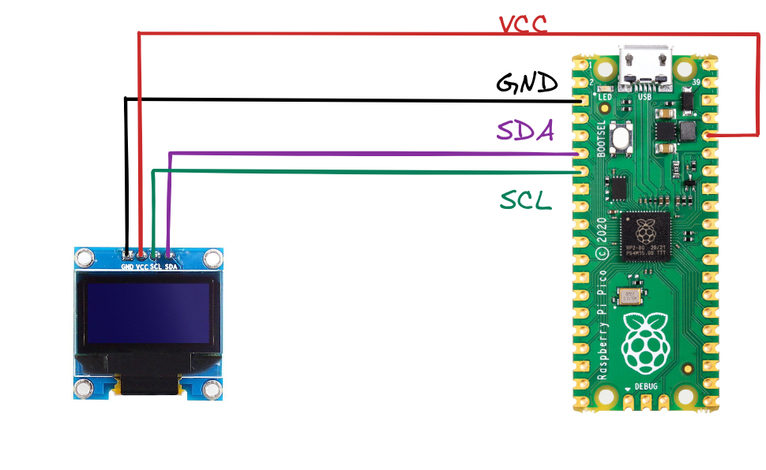
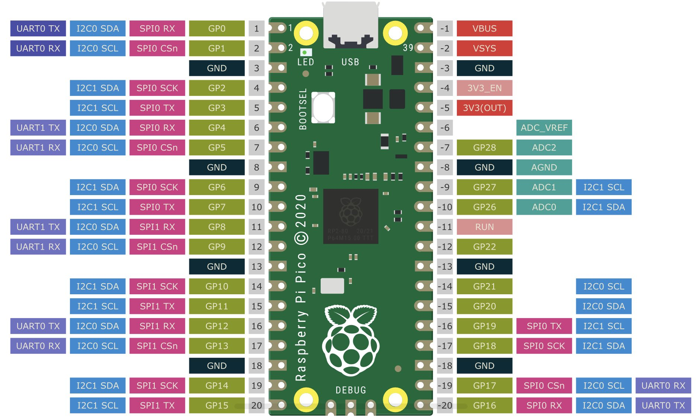

# Raspberry Pi Pico With OLED Display

## Working Examples

- [Static Bitmap](./bitmap/)
- [Animations](./animation/)

## Notes

### Device Drivers

The below command pulls [device drivers](https://tinygo.org/docs/reference/devices/) for Tinygo development environment.

```bash
go get tinygo.org/x/drivers
go get tinygo.org/x/tinydraw

```

### Monitoring

```bash
minicom -b 115200 -8 -D /dev/ttyACM0
```

### Wiring Diagram



## Raspberry Pi Pico Pinout



## References

- [TinyGo I2C](https://tinygo.org/docs/concepts/peripherals/i2c/)
- [TinyGo ssd1306 Driver](https://github.com/tinygo-org/drivers/tree/release/ssd1306)
