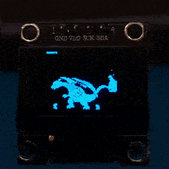

# Displaying Animations

## Workflow

1. Find GIF you want to display ([Tenor](https://tenor.com/), [Giphy](https://giphy.com/),..);
2. Split GIF into frames ([GIF frame extractor](https://ezgif.com/split))
3. Covert each frame into Bitmap ([Image2CCP](https://javl.github.io/image2cpp/));
4. Embed it in source code ([frames.go](./frames.go)). An advanced option would be to side-load it from an SD card or any other flash memory;
5. Fun & profit!

## Demo

## References

- [Image2CCP](https://javl.github.io/image2cpp/)
