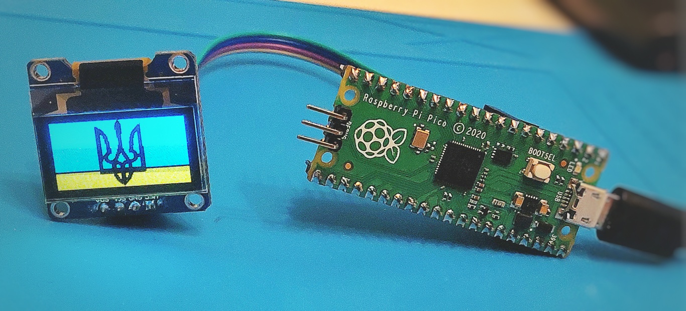

# Displaying Bitmap Images

## Demo

## References

- [Image2CCP](https://javl.github.io/image2cpp/)
- [Interface OLED Graphic Display Module with Arduino](https://lastminuteengineers.com/oled-display-arduino-tutorial/)
  https://lastminuteengineers.com/oled-display-arduino-tutorial/
